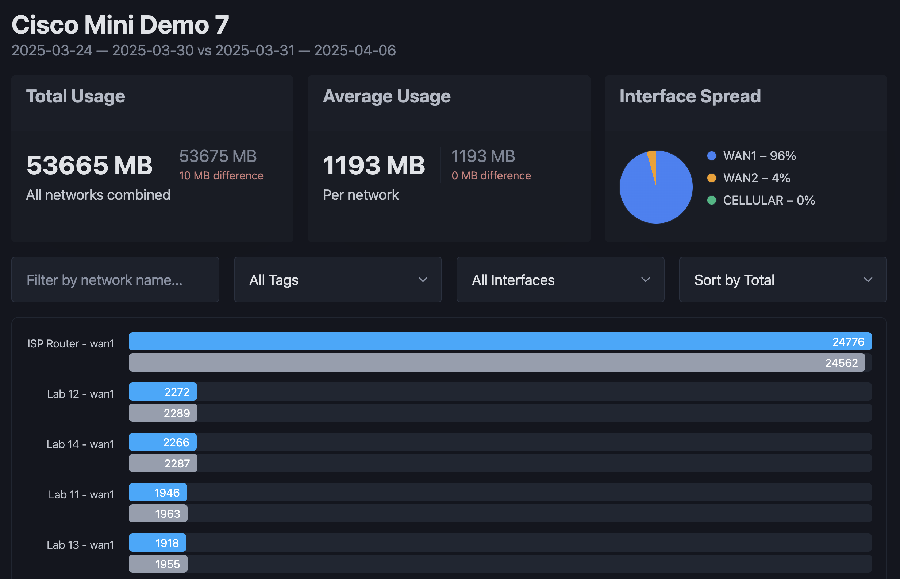

# 📡 Meraki WAN Usage Dashboard

A modern, lightweight web app for analyzing WAN uplink usage across Meraki networks. Built with **Svelte** and **Flask**, this tool allows users to filter, compare, and visualize WAN usage by interface, date, and organization.



## 📚 Table of Contents

- [🚀 Features](#-features)
- [✨ Tech Stack](#-tech-stack)
- [🧠 How It Works](#-how-it-works)
- [🚀 Getting Started](#-getting-started)
  - [📦 Clone the repository](#-clone-the-repository)
  - [🔧 Install Dependencies](#-install-dependencies)
  - [🧪 Running the App (Development)](#-running-the-app-development)
  - [🚢 Run in Production](#-run-in-production)
- [📄 API Notes](#-api-notes)

## 🚀 Features

- 📅 **Report Modes**:

  - Single day
  - Last 30 days (month)
  - Weekly and compare weeks
  - Compare any two days

- 📊 **Visual Insights**:

  - Animated usage counters (total & average)
  - Interface usage pie chart with legend
  - Compare data inline with differences highlighted
  - Dynamic unit switch (MB or GB)

- 📁 **Filters**:

  - Search by network name
  - Filter by WAN interface (wan1, wan2, cellular)
  - Filter by network tags (if configured)

- 🌗 **Dark Mode** toggle

## ✨ Tech Stack

- **Frontend**: Svelte 5 with Typescript & Vite
- **Backend**: Flask + Meraki Python SDK
- **Styling**: PicoCSS

## 🧠 How It Works

1. **Backend (Flask)**  
   Calls the Meraki Dashboard API to fetch uplink usage per network via:

   ```
   /organizations/{orgId}/appliance/uplinks/usage/byNetwork
   ```

   The API accepts custom time ranges (`t0` and `t1`) and returns sent/received bytes by interface.

2. **Frontend (Svelte)**
   - A settings drawer lets you choose:
     - Org and report type
     - Date/week/month ranges
   - Data is stored in reactive state (`$state`) and passed to charts and summaries.
   - You can compare two datasets (e.g., two weeks or days).

## 🚀 Getting Started

### 1. 📦 Clone the repository

First, clone the project from GitHub:

```bash
git clone https://github.com/benbenbenbenbenbenbenbenbenben/meraki-wan-usage.git
cd meraki-wan-usage
```

## 🔧 Install Dependencies

Use the Makefile to install all prerequisites:

```bash
make install
```

This will:

- Create a Python virtual environment in `backend/`
- Install all Python dependencies listed in `requirements.txt`
- Install all Node.js packages for the frontend (Svelte)

## 🧪 Running the App (Development)

To run the backend (Flask) and frontend (Svelte) dev servers, each should be run in own terminal:

Terminal 1:

```bash
export MERAKI_DASHBOARD_API_KEY=YOUR_API_KEY
make backend-dev     # Starts Flask backend on port 5002
```

Terminal 2:

```bash
make frontend-dev    # Starts Svelte frontend on port 5173
```

Your frontend will proxy API requests to the Flask backend automatically.

## 🚢 Run in Production

To run the backend with the latest frontend build:

```bash
make frontend-build   # Build the production frontend
make run-prod         # Start the Flask backend (serves frontend too)
```

Make sure the `MERAKI_DASHBOARD_API_KEY` environment variable is set.

## 📄 API Notes

- Uplink data is available only for the last **30 days**.
- Aggregation is done in chunks (weekly) as max fetch period is **14 days**.
- Comparison reports return a structure like:

```json
{
  "primary": [...],
  "compare": [...]
}
```
